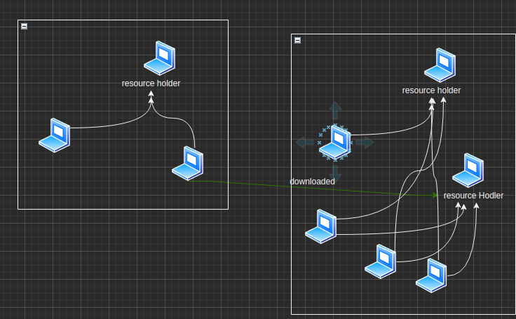

# YUKI

YUKI 是一个高性能的分布式文件传输框架，用于解决局域网内大规模文件分发场景下，单点服务器压力过大的问题。

## 概述

传统单点的文件传输服务，受到带宽等资源限制，在面对多个客户端并发请求时，传输能力会大幅度减弱。

针对此特点，结合分布式系统相关知识，开发了此框架，核心思想是想要将传输压力均匀负载在每一个资源拥有者上。

如上图所示，我们希望在此局域网内的每个节点都是对等的，一旦一个节点现在资源完毕，他会自动成为一个资源拥有者，就可以向外界提供服务，当集群内存在两个及以上资源拥有者的时候，请求节点可以并行向资源拥有者请求资源。

## 架构

### NodeServer

## 示例产品

吸取了dubbo2在面对百万实例集群时的经验，由metadata的。。。