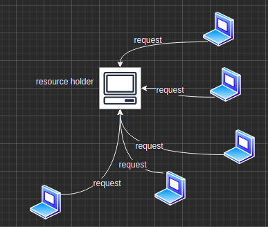

# YUKI

YUKI 是一个高性能的分布式文件传输框架，用于解决大规模文件分发场景下，单点服务器压力过大的问题。

## 概述

如下图所示，传统单点的文件传输服务，受到带宽等资源限制，在面对多个客户端并发请求时，传输能力会大幅度减弱。



针对这种场景，我们很容易可以想到做下边这样的优化。

如下图所示，我们注意到，在一台机子，完全接受了资源之后，它其实完全可以再向外提供传输服务，来分担了原有服务器的压力，加速集群内资源分配速率。同时一个客户端也并不一定只向一台服务器做请求，可以通过多线程并行向多个服务器请求分片过的资源。


但由于去中心化以后，服务节点具有动态性，如果靠人工去开启服务，配置路由信息，显然会增加开发与运维成本，为解决这个问题，我们引入了微服务架构中常见的服务发现的概念。

首先做了如下抽象，每台机子，在集群中都可以看作一个节点（NodeServer），节点之间是对等的，每个NodeServer实例都具备请求资源的功能，如果开启NodeServer的传输服务，那么他同时具有向外提供传输服务的功能。   

当遇到下载请求时，每个NodeServer都会向注册中心Registry发起连接，从而动态得到资源和资源拥有者列表，同时每当一个NodeServer成为这个资源的拥有者以后，这个NodeServer会将这份资源注册到本地，如果这台NodeServer同时开启这传输服务，那么这份资源也会被注册到远程注册中心。


这样就很好的解决了资源动态发现与动态配置的问题，可是我们也注意到相比于传统的单点服务器的文件传输服务，分布式的文件传输服务，开发起来难度相对较大，所以针对这个问题我开发了这样一个简化开发的框架 YUKI。

YUKI 屏蔽掉了底层服务注册与服务发现等多方面细节，为上层应用提供了一个与传统单点传输服务开发无异的视图，可以说是大大简化了开发难度，同时目前已支持通过springboot接入，大大简化了开发与配置的复杂度。


## 特性

### for deveper

1.   简单易用

     提供了简单的API，同时提供了springboot-start的接入方式。

2.   极强的可扩展性

     模块之间通过spi机制进行解耦，例如目前registry模块，考虑到注册中心的高可用性，主要由zk作为主要制成实现，将来会推出，redis，mysql实现的版本，只需要更改配置文件，而不用更改原有的代码。

3.   超高性能

     采用了高性能io库Netty作为传输层框架，同时在linux环境下，会自主选择采用sendfile零拷贝技术，减少内存之间的拷贝，从而加速文件传输速度。


### for user

1.   支持telnet协议。命令行式简单的使用方式（当然以后会推出web版的使用方式）

2.   支持资源发现

     不需要用户手动配置服务器。

2.   支持多线程下载

     智能探测节点健康状况，从而在进行负载均衡后，选择出定量的健康节点进行传输。避免因单个节点的健康状况，导致某些传输任务长时间不能完成。

3.   支持多线程断点续传

     通过aof机制，在NodeServer意外宕机后仍可以可配置的粒度进行状态恢复并进行续传，若在传输过程中，某条连接断掉，那么这条连接上的剩余传输任务，也可快速转移到其他节点进行断点传输。


## 使用YUKI

目前已经发布了Yuki-0.0.1-Alpha版本，你可以从这里得到他  https://github.com/akaakking/Yuki/releases/tag/alpha


### 安装并启动

1.   首先需要部署一个可以访问到的zk实例

     下载安装具体可参考 

     启动zk实例

     ```shell
     sudo zkServer.sh start
     ```

2.   解压下载的Yuki安装包

     安装包目录结构如下

     ```shell
     -Yuki
     	-Yuki.jar
     	-application.yml
     	-start.sh
     	-lib
     		-...
     ```

     

     修改yaml

     ```yml
     yuki:
       # 记录本地资源列表，以及传输信息。
       aof-path: /home/wfh/YukiTest/aof
       # 提供下载服务的端口，会被注册到注册中心
       port: 9140
       registry:
       # 注册中心port
         port: 2181
       # 注册中心ip
         ip: 192.168.30.2
       # 最大同时向外提供服务的个数，根据本机性能而定，此参数会影响到柔性负载
       max-servicing: 3
     telnet:
       # telnet服务端口
       port: 11111
     ```

3.   启动 Yuki

     ```shell
     sudo ./start.sh
     ```

4.   使用telnet连接Yuki实例

     ```shell
     # ip是实例ip
     # port是yml里边的telnet port
     telnet ip port
     ```

     出现这样的界面说明连接成功啦


### 使用Yuki

1.   regist

     ```shell
     # 语法
     regist resourceId path
     ```

     将资源注册到整个集群中，注意必须在开启服务后才可以注册

2.   service

     ```shell
     # 开启服务
     service start
     # 关闭服务
     service stop
     # 查看服务是否开启，以及节点负载状况
     service status
     ```

     

3.   search 

     ```shell
     # 查找所有
     search *
     # 模糊查询
     search pre
     ```

4.   show

     ```shell
     show local
     show remote
     ```

5.   download

     ```shell
     download {resourceid} to {path}
     ```

6.   shutdown

     关闭实例

7.   exit

     关闭会话,但不关闭实例。